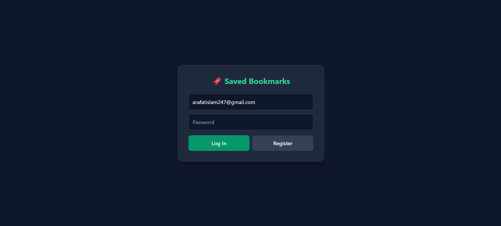

# Bookmark Manager



A simple, secure bookmark manager API built with FastAPI, SQLModel, and JWT authentication.

## Features
- User registration and login (JWT-based auth)
- Create, read, update, and delete personal bookmarks
- Each user only sees their own bookmarks
- Minimal built-in web UI

## Tech Stack
FastAPI · SQLModel · PyJWT · bcrypt · SQLite · uv · Docker

## Setup

```bash
git clone https://github.com/ArafatIslam27/Bookmark-Manager.git
cd Bookmark-Manager
uv sync
$env:SECRET_KEY="your-random-secret-here"   # PowerShell
uv run uvicorn bookmark_manager.main:app --reload
```

Visit http://localhost:8000

## API Endpoints

| Method | Endpoint | Description | Auth required |
|--------|----------|--------------|----------------|
| POST | /auth/register | Create a new account | No |
| POST | /auth/login | Log in, get access token | No |
| GET | /bookmarks/ | List your bookmarks | Yes |
| POST | /bookmarks/ | Create a bookmark | Yes |
| PATCH | /bookmarks/{id} | Update a bookmark | Yes |
| DELETE | /bookmarks/{id} | Delete a bookmark | Yes |
| GET | /health | Health check | No |

## Running tests

```bash
uv run pytest -v
```
